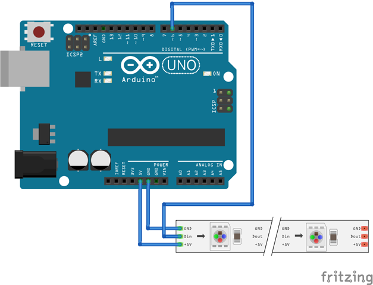
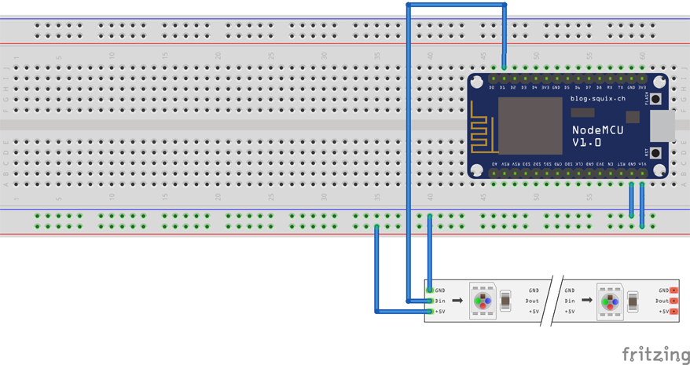
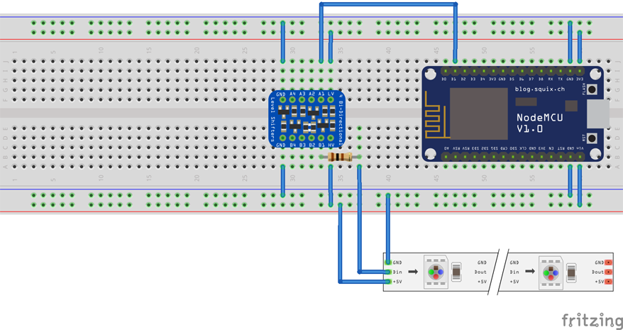

# WS2812FX User’s Guide


WS2812FX is a library of lighting effects, which allows
[Arduino](https://www.arduino.cc/) or
[ESP8266](https://en.wikipedia.org/wiki/ESP8266) microcontrollers to control
[WS2812](http://www.world-semi.com/products/details-178.html) programmable LEDs.
WS2812FX has over 50 pre-programmed effects, which can be used to create dazzling
light shows.
***

## Disclaimer

Although the voltages and components used in WS2812FX projects are generally
safe, working with electronics does carry some risk. So…

Descriptions of circuits, software and other related information in this
document are provided only to illustrate the use of WS2812FX. You are fully
responsible for the incorporation of these circuits, software, and information
in the design of your project. WS2812FX contributors and maintainers assume no
responsibility for any losses incurred by you or third parties arising from the
use of these circuits, software, or information.

The authors have used reasonable care in preparing the information included in
this document, but we do not warrant that such information is error free. We
assume no liability whatsoever for any damages resulting from errors in or
omissions from the information included herein.
***

## What you need

To use WS2812FX you’ll need, at a minimum, a supported microcontroller, some
WS2812 LEDs and a software development environment to program the
microcontroller. A breadboard and sundry electronic components, like jumper
wires, resistors, capacitors and an LED or two are also handy.

1.  The Microcontroller  
      
    WS2812FX supports most variants of the Arduino microcontroller, as well as
    the newer ESP8266 and ESP32 processors. An Arduino is adequate for creating
    a basic lighting project, but it suffers from a relatively small amount of
    memory and has no built-in network connectivity. The ESPs have much more
    memory as well as built-in Wi-Fi and is quite inexpensive, so it’s usually
    a better choice. If you’re just starting out, I’d suggest buying an ESP8266
    development board, such as the
    [NodeMCU](https://en.wikipedia.org/wiki/NodeMCU), which includes the ESP8266
    and some helpful support circuitry (like a 3.3V regulator and USB-TTL
    adapter) in one convenient package. The dev board allows you to power and
    program the board using a standard USB port.

2.  The WS2812 LEDs

    WS2812FX supports several variants of WS2812-type LEDs, including the
    WS2811, WS2812 and WS2812B. These LEDs are sometimes referred to
    collectively as [NeoPixels](https://www.adafruit.com/category/168), which
    is Adafruit’s brand of programmable LEDs. The LEDs have several nice features:

    - Powered by a 5V supply. If you only have a few, they can be powered by
    the same USB cable use to power and program the Arduino or ESP8266 dev board.

    - Data transfer is done using a simple 1-wire serial interface. When the
    LEDs are wired in cascade, you drive the first LED from the microcontroller
    and each LED automatically passes data to the next LED in the chain.

    - You don’t have to buy them individually and wire them all together yourself.
    Instead you can buy them in many convenient configurations, such as long
    strips with 30/60/144 LEDs per meter or arranged in circles, squares and
    even 3D cubes.
    

1.  The Development Environment  
      
    WS2812FX is written as an extension of the Adafruit NeoPixel library, so
    we’ll be using the [Arduino IDE](https://www.arduino.cc/en/Main/Software) to
    create our LED programs. If you don’t have it installed already, download
    and install the IDE as described on the arduino.cc website. If you’re
    totally new to Arduino, you should read over the
    [Getting Started](https://www.arduino.cc/en/Guide/HomePage) guide to get
    familiar with the general programming concepts and IDE workflow, and try
    a few of the [tutorials](https://www.arduino.cc/en/Tutorial/HomePage). You
    should be able to load and run the ubiquitous
    [blink](https://www.arduino.cc/en/Tutorial/Blink) example before diving into
    programming with the WS2812FX library.

    You’ll also need to install the WS2812FX and Adafruit NeoPixel libraries,
    which is also covered on the Arduino.cc web site’s
    [libraries](https://www.arduino.cc/en/Guide/Libraries) section. Both the
    WS2812FX and Adafruit NeoPixel libraries can be installed using the Library
    Manager.

    If you’re using an Arduino microcontroller, you’re good to go. But if you’re
    using an ESP8266, you’ll need to install the ESP8266 core platform package
    using Boards Manager as described on the
    [ESP8266 platform](https://github.com/esp8266/Arduino#installing-with-boards-manager)
    GitHub site. There’s a wealth of information about programming the ESP8266
    at the platform’s
    [documentation](https://arduino-esp8266.readthedocs.io/en/latest/) web site.

    Similarly, if you're using an ESP32, you'll need to install the ESP32 core
    platform package using Boards Manager as described on the
    [ESP32 platform](https://github.com/espressif/arduino-esp32) Github site.

    Now you’re ready to go.
***

## Hardware Setup

The hardware setup is pretty similar for the Arduino and ESP8266. Simply use the
5V and GND from the microprocessor to power the WS2812 LEDs, and connect a
digital I/O pin to the LED’s Din lead. Simple, but a few things can go wrong. If
your WS2812s are configured in a strip, as shown in the fritzing diagram, note
that the strip has a beginning and an end. Usually there’s an arrow printed on
the strip which points from the beginning of the strip to the end of the strip.
Connect your microcontroller to the beginning of the strip. If you connect it to
the end of the strip, it will not work. This is true whenever WS2812 LEDs are
wired in series. The data signal from the microcontroller is delivered to the
Din of first LED and the Dout of the first LED drives the Din of the next LED,
and so on down the chain.



Similarly, for the ESP8266, connect the strip to 5V, GND and a digital I/O pin.



But wait! There is a small caveat. The ESP8266 is a 3.3V device and the WS2812
is a 5V device. On a development board, like the NodeMCU, there’s an onboard 5V
to 3.3V voltage regulator to convert the 5V from the USB plug to 3.3V to power
the ESP. Very convenient, but the ESP will still only drive its digital I/O pins
to 3.3V, which technically isn’t brawny enough to drive the WS2812’s Din pin.

One solution to this dilemma is to just ignore it. Although a direct interface
like this is out of spec, WS2812 LEDs tend to be pretty forgiving when it comes
to signals at the Din pin. Driving it with a 3.3V signal usually works fine.
But, if you find your project is behaving erratically or just want a more robust
implementation, you can use a level shifter to translate the ESP’s 3.3V I/O to
the 5V signal expected by the WS2182.

This diagram shows a design using an [Adafruit 4-channel level
shifter](https://www.adafruit.com/product/757) wired between the ESP I/O and the
WS2812 Din pin.



One other thing to keep in mind is power requirements. Each WS2812 can consume
about 60mA when driven to full intensity. More LEDs mean more current, so more
than a few will exceed the USB plug’s capacity to supply power to the LEDs and
microcontroller. That’s when you need an external power supply. A simple 5V cell
phone charger may suffice or you may need a standalone, switching power supply
if you plan on using hundreds of LEDs in your project. Do the math and plan
accordingly.

Speaking of hardware design, the good folks at Adafruit have put a lot of time
and energy into their NeoPixel products and have written some excellent hardware
guides. Of special interest is their
[NeoPixel UberGuide](https://learn.adafruit.com/adafruit-neopixel-uberguide).
It is full of great tips and best practices that will save you time and
aggravation. Go read it.

Note, as mentioned in Adafruit's guide, it's recommended that a 300-500Ω
resistor be connected between the microcontroller GPIO pin and WS2812 DI pin
to reduce noise and improve signal reliability. It's also strongly advised
to connect a large capacitor (say 1000uF) between the WS2812 VDD and VSS pins
to minimize power supply noise.
***

## WS281FX Basics

So let’s create your first WS2812FX sketch. A strip of WS2812 LEDs is a common
configuration, so the examples in this guide will assume you’re programming a
strip of LEDs. A basic sketch looks like this:
```c++
// Import the WS2812FX functions and features into your sketch
#include <WS2812FX.h>

// Declare how many LEDs are in your strip and the microprocessor
// GPIO pin being used to drive the strip. Adjust these for your
// particular hardware setup.
#define LED_COUNT 30
#define LED_PIN 5

// Create a WS2812FX object to represent your strip. Note it uses the
// LED_COUNT and LED_PIN values to specify its characteristics. NEO_GRB
// is a keyword that describes the order in which the WS2812’s individual
// red, green and blue LEDs are programmed. NEO_GRB is very common, but
// if you find the red and green colors are reversed, try NEO_RGB.
WS2812FX ws2812fx = WS2812FX(LED_COUNT, LED_PIN, NEO_GRB + NEO_KHZ800);

void setup() {
    // Initialize the strip
    ws2812fx.init();

    // Set the LED’s overall brightness. 0=strip off, 255=strip at full intensity
    ws2812fx.setBrightness(255);

    // Set the animation speed. 10=very fast, 5000=very slow
    ws2812fx.setSpeed(2000);

    // Set the color of the LEDs
    ws2812fx.setColor(RED);

    // Select an animation effect/mode. 0=static color, 1=blink, etc. You
    // can specify a number here, or there some handy keywords defined in
    // the WS2812FX.h file that are more descriptive and easier to remember.
    ws2812fx.setMode(FX_MODE_BLINK);

    // Start the animation
    ws2812fx.start();
}

void loop() {
    // continually run the animation service
    ws2812fx.service();
}
```

The sketch’s comments describe the purpose of each statement. Open this sketch
in the Arduino IDE and upload it to your microcontroller. If all goes well, you
should see a strip of blinking red LEDs. If not double check your wiring and
make sure the LED_COUNT and LED_PIN declarations in the sketch match your
hardware setup.

After you have the sketch working, you can play with the settings to get a feel
for how each parameter affects the strip. Vary the speed and brightness. The
color can be changed by specifying one of the built-in color macros:
```c++
#define RED        (uint32_t)0xFF0000
#define GREEN      (uint32_t)0x00FF00
#define BLUE       (uint32_t)0x0000FF
#define WHITE      (uint32_t)0xFFFFFF
#define BLACK      (uint32_t)0x000000
#define YELLOW     (uint32_t)0xFFFF00
#define CYAN       (uint32_t)0x00FFFF
#define MAGENTA    (uint32_t)0xFF00FF
#define PURPLE     (uint32_t)0x400080
#define ORANGE     (uint32_t)0xFF3000
#define PINK       (uint32_t)0xFF1493
#define GRAY       (uint32_t)0x101010
#define ULTRAWHITE (uint32_t)0xFFFFFFFF /* for RGBW LEDs */
```
Or use a hexadecimal number, like 0x40c020, to create a unique color by
mixing different intensities of red, green and blue.
The [w3schools.com colors](https://www.w3schools.com/colors/) web page has a
nice explanation about expressing colors as hexadecimal numbers. Note, the web
page shows hex numbers as “\#RRGGBB”, but in the Arduino IDE they are written
“0xRRGGBB”.

The best part of WS2812FX is the many different animation effects that it can
create. More than 50! The only way to get a feel for each one is to try them. In
the sketch, change the ws2812fx.setMode() parameter to invoke a different
effect. The library’s WS2812FX.h file contains the complete list of effect
keywords to choose from:
```c++
#define FX_MODE_STATIC 0
#define FX_MODE_BLINK 1
#define FX_MODE_BREATH 2
#define FX_MODE_COLOR_WIPE 3
. . .
```
Everyone loves FX_MODE_LARSON_SCANNER, so be sure to check that one out.
***

## More Then The Basics

After you’re comfortable with the basic sketch, it’s time to move on to
something more interesting. The WS2812FX library’s example folder is a good
place to start. In the Arduino IDE’s File menu go to Examples WS2812FX and load
the ws2812fx_segments sketch. In the previous basic sketch we specified each
effect parameter, like color and speed, on an individual line. But there’s a
shorthand and more powerful method using the setSegment() function, which lets
you program all the effect parameters on one line.
```c++
// parameters: index, first, last, mode, color, speed, reverse
ws2812fx.setSegment(0, 0, LED_COUNT-1, FX_MODE_BLINK, RED, 2000, false);
```
The first setSegment() parameter is the segment index. A strip can be subdivided
into as many as 10 segments and each segment can be programmed independently.
Note the segments are numbered from 0-9, not 1-10. The index of the first
segment is 0, the second is 1, the third is 2, etc. This is pretty common in the
programming world, where ordered collections are numbered starting at 0, not 1
like we’re taught in kindergarten. Don’t fight it; it’s just one of those things
you have to accept. Namaste.

The second and third setSegment() parameters are, respectively, the index of the
first LED in the segment and the index of the last LED in the segment. Remember,
indexes start at 0, not 1. Since LED_COUNT represents the number of LEDs in our
strip, LED_COUNT-1 would be the index of the last LED in the strip. So
specifying 0 for the first index, and LED_COUNT-1 for the last index would
program a segment that spans the entire length of the strip. Think about it; it
makes sense.

The next three parameters are effect/mode, color and speed, which you’ve seen
before. The last parameter is optional and specifies whether to run the animation in
the reverse direction. It’s a boolean parameter, so it can be true or false, and
applies only to effects that have a direction, like FX_MODE_COLOR_WIPE or
FX_MODE_THEATER_CHASE. Specifying reverse=false will run the animation from
left-to-right, while specifying reverse=true will run the animation from
right-to-left. Give it a try and you’ll see what I mean.

So with the ws2812fx_segments sketch loaded, adjust the LED_PIN and LED_COUNT
values to suit your hardware setup. The sketch is written for a strip of 30
LEDs, so you may need to adjust the first and last LED parameters in the
setSegment() statements to reflect the number of LEDs in your project. Upload it
to your microcontroller and voila, you’ve mastered segments!
***

## More About Segments

Segments provide a great deal of flexibility to subdivide the strip. You can
hard code the first and last LED indexes like so:
```c++
// divide a strip of 30 LEDs in half
ws2812fx.setSegment(0,  0, 14, FX_MODE_FADE, RED,  2000);
ws2812fx.setSegment(1, 15, 29, FX_MODE_SCAN, BLUE, 2000);
```
or you can use LED_COUNT and some math to specify the first and last LED
indexes:
```c++
// divide a strip of LEDs into thirds
int size = LED_COUNT/3; // calc the size of each segment
ws2812fx.setSegment(0, 0,      size-1,      FX_MODE_FADE,  RED,   2000);
ws2812fx.setSegment(1, size,   size*2-1,    FX_MODE_SCAN,  BLUE,  2000, true);
ws2812fx.setSegment(2, size*2, LED_COUNT-1, FX_MODE_COMET, GREEN, 2000, true);
```
This allows your project to accommodate strips of different lengths just by
changing the LED_COUNT value;

setSegment() also allows you to specify up to three colors using this syntax:
```c++
uint32_t colors[] = {RED, GREEN, BLUE}; // create an array of colors
ws2812fx.setSegment(0, 0, LED_COUNT-1, FX_MODE_BLINK, colors, 2000);
```
or there's a COLORS(...) macro that can be used to express colors more succinctly:
```c++
ws2812fx.setSegment(0, 0, LED_COUNT-1, FX_MODE_BLINK, COLORS(RED, GREEN, BLUE), 2000);
```
There's also the DIM and DARK macros which can modify a color's intensity.
DIM reduces a color's intensity by 74% and DARK reduces intensity by 94%.
```c++
uint32_t colors[] = {RED, DIM(GREEN), DARK(BLUE)};
```
Not all modes support multiple colors. FX_MODE_COLOR_WIPE, for instance, will
alternate between the first and second color. FX_MODE_TRICOLOR_CHASE creates a
chase animation using all three colors. If you use the setSegment() syntax which
specifies only one color, then the other two colors default to black (the LED
will be off). Some modes ignore the color parameter, like the various rainbow
modes, which create; you guessed it, a rainbow of colors.
***

## Even More About Segments

WS2812FX v1.0.3 introduced another setSegment() syntax to provide even more
options. The new syntax looks like this:
```c++
// parameters: index, first, last, mode, colors[], speed, options
ws2812fx.setSegment(0, 0, LED_COUNT-1, FX_MODE_FADE, colors, 2000, NO_OPTIONS);
```
The new options parameter takes the place of the boolean reverse parameter.
Options is an 8-bit value where each bit in the byte enables an animation
alternative. As of this writing there are four options: reverse, gamma
correction, fade rate and size.

- reverse – like the boolean reverse parameter, just a new way of selecting
    the reverse animation direction.
    ```c++
    ws2812fx.setSegment(0, 0, 9, FX_MODE_FADE, colors, 2000, REVERSE);
    ```

- gamma correction – our eyes have evolved to respond in a non-linear way to
    the intensity of light in the visible spectrum. In a nutshell, we do not
    perceive an LED brightness setting of 100 to be half as bright as a
    brightness setting of 200. [Adafruit’s gamma
    correction](https://learn.adafruit.com/led-tricks-gamma-correction/the-issue)
    article has a good explanation of this non-linear relationship and provides
    a technique to compensate for it. Setting this option enables the Adafruit
    gamma trickery.
    ```c++
    ws2812fx.setSegment(0, 0, 9, FX_MODE_FADE, colors, 2000, GAMMA);
    ```

- fade rate – several of the WS2812FX modes use a fade function to gradually
    reduce the intensity of LEDs, essentially fading the LED to black. This is
    easily seen in the FX_MODE_COMET mode, where the “tail” of the comet
    gradually fades away. Before WS2812FX v1.0.3 the fade rate (speed) was fixed
    and you could only fade to black. Now you can adjust the fade rate and fade
    to any color. The second color in the colors[] array is the fade-to-color,
    and the options parameter selects the fade rate. The following code would
    create a red comet on a green background, with the extra-slow fade creating
    a comet with a long tail.

    ```c++
    uint32_t colors[] = {RED, GREEN, BLACK};
    ws2812fx.setSegment(0, 0, 9, FX_MODE_COMET, colors, 2000, FADE_XSLOW);
    ```

- size – several of the WS2812FX modes create pixel patterns that move across
    the length of the LED strip. SCAN is a good example that shows one pixel
    moving across a background color. This works fine for relatively short
    strips of LEDs, but with longer lengths, the lone pixel tends to get lost
    in the sea of background pixels. So the SIZE option was introduced in
    WS2812FX v1.1.5 to allow you to adjust the size of the block of moving
    pixels. The default SIZE_SMALL option would show the usual one pixel moving
    across the background, while SIZE_XLARGE would show a block of eight pixels.
    The following code would create a red block of 4 pixels 'scanning' across
    a green background.

    ```c++
    uint32_t colors[] = {RED, GREEN, BLACK};
    ws2812fx.setSegment(0, 0, 9, FX_MODE_SCAN, colors, 2000, SIZE_LARGE);
    ```

The options are spelled out in the ws2812fx.h file.
```c++
#define NO_OPTIONS   (uint8_t)0b00000000
#define REVERSE      (uint8_t)0b10000000
#define FADE_XFAST   (uint8_t)0b00010000
#define FADE_FAST    (uint8_t)0b00100000
#define FADE_MEDIUM  (uint8_t)0b00110000
#define FADE_SLOW    (uint8_t)0b01000000
#define FADE_XSLOW   (uint8_t)0b01010000
#define FADE_XXSLOW  (uint8_t)0b01100000
#define FADE_GLACIAL (uint8_t)0b01110000
#define GAMMA        (uint8_t)0b00001000
#define SIZE_SMALL   (uint8_t)0b00000000
#define SIZE_MEDIUM  (uint8_t)0b00000010
#define SIZE_LARGE   (uint8_t)0b00000100
#define SIZE_XLARGE  (uint8_t)0b00000110
```

Options can be combined. If you wanted to create a segment with both reverse
direction and gamma correction, you would add the options like so:
```c++
uint8_t options = REVERSE + GAMMA;
ws2812fx.setSegment(0, 0, 9, FX_MODE_COMET, colors, 2000, options);
```
or like this:
```c++
ws2812fx.setSegment(0, 0, 9, FX_MODE_COMET, colors, 2000, (uint8_t)(REVERSE + GAMMA);
```
Specifying reverse and gamma correction and fade rate would look like this:
```c++
uint8_t options = REVERSE + GAMMA + FADE_GLACIAL;
ws2812fx.setSegment(0, 0, 9, FX_MODE_COMET, colors, 2000, options);
```
***

## Custom Effects

If you're not satisfied with the lighting effects built-in to WS2128FX,
or you're just looking for a challenge, you can build your own custom
effects. To be honest, this isn't trivial. Creating a custom effect
sometimes requires an in-depth knowledge of how segments work and what the
segment API provides. You may need to dig into the WS2812FX source code to
gain a deeper understanding of how it works. But if you think you've got
the programming chops, go for it! There's two example sketches,
**ws2812fx_custom_effect** and **ws2812fx_custom_FastLED**, that might help
you get started.

The basic steps are:
1.  Create a function that manipulates the LEDs in the segment to implement
your effect. It must return a uint16_t value, usually the segment's speed value.
```c++
uint16_t myCustomEffect(void) {
  int numColors = 7; // define a color pallette, say blueish-greenish
  uint32_t colors[] = {BLUE, GREEN, 0x002080, 0x008020, 0x002020,  0x002000, 0x000020};

  // get the current segment
  WS2812FX::Segment* seg = ws2812fx.getSegment();

  // loop through the segment's LEDs, updating each LED in some way
  for(uint16_t i=seg->start; i<=seg->stop; i++) {
    ws2812fx.setPixelColor(i, colors[random(numColors)]); // random colors from the pallette
  }
  return seg->speed; // return the segment's speed
}
```
2.  Call the WS2812FX setCustomEffect() function, passing the name of your
custom effect function.
    ```c++
    ws2812fx.setCustomMode(myCustomEffect);
    ```
    or if you want to assign a name to your custom effect, use this syntax:
    ```c++
    ws2812fx.setCustomMode(F("My Custom Effect"), myCustomEffect);
    ```
3.  Create a segment using the FX_MODE_CUSTOM mode.
```c++
ws2812fx.setSegment(0, 0, LED_COUNT-1, FX_MODE_CUSTOM, RED, 300);
```
***

## More About Custom Effects

The custom effect feature has evolved to the point where several pre-built
custom effects are included in WS2812FX's src/custom folder. These effects
tend to be more complex then the standard set of effects, and fitting them
all in an Arduino's limited flash memory would be a problem. So they're
broken out into separate files so users can pick and choose which custom
effects to include in their project.

Note, there are eight custom effect 'slots' available. A custom effect is
assigned to a slot by calling the setCustomMode(name, *p) or
setCustomMode(index, name, *p) functions. For guidance, see
the **ws2812fx_custom_effect2** example sketch.

***

## Custom Show() function

Another of WS2812FX's more advanced features is it's support for a custom show()
function. By default, when WS2812FX needs to update the LED colors, it calls
Adafruit_NeoPixel's built-in show() function. Show() is the function that takes
care of actually sending pulses to the LED's Din pin, which update the LED's
color. The show() function built-in to Adafruit_NeoPixel works perfectly fine,
but it does have one drawback. It disables interrupts. What this means is that
while the LEDs are being updated, all background processes are suspended. On
an ESP8266, the WiFi processing is blocked, or on an Arduino the PWM output
will hang. Admittedly the LED update happens very fast (about 30 microseconds
per LED), and interrupts are suspended for a very short amount of time. But this
short "pause" can cause problems with time critical applications. Adafruit has
a nice [article](https://learn.adafruit.com/neopixels-and-servos/overview)
that talks about this issue.

By creating a custom show() function, you can bypass the Adafruit show() function
and create you're own completely different way of updating the LED colors. For
example, a custom show() function could be used to communicate the LED state
over a network to a collection of remote devices. Or the **ws2812fx_dma**
example sketch uses a custom show() function and the NeoPixelBus library's
DMA feature to drive the LEDs without disabling interrupts. To be sure, this
is an advanced feature, not for the faint of heart. It requires a healthy
knowledge of the WS2812 Din timing requirements and probably a deeper
understanding of WS2812FX's inner workings. But if you have a project that needs
to handle driving the LEDs in a unique way, then a custom show() function may
be the solution. See the **ws2812fx_spi** example sketch, which uses a custom
show() function to drive DotStar/APA102 LEDs, to get you started.

The basic idea follows the custom effect implementation.
1.  Create a function that transforms the LED data into a form that can create
the pulse train required by the LEDs. This is the hard part.
2.  Call the WS2812FX setCustomShow() function, passing the name of your custom
show() function.
```c++
ws2812fx.setCustomShow(myCustomShow);
```

***

## Segment management

As of v1.3.0 WS2812FX provides more fine grained management of segments by
introducing the idea of idle segments. Segments can be created
in an "idle" state using the setIdleSegment() function. These segments are
initially inactive and can be activated at a later time by using the
addActiveSegment() or swapActiveSegment() functions. Active segments can be
returned to the idle state by using the removeActiveSegment() function. In this
way you can create a bunch of segments, and then pick and choose which segments
are active at runtime. See the **ws2812fx_segment_sequence** example sketch.

***

## One More Thing

Once you’ve mastered controlling LEDs with WS2812FX you’re ready to start
interfacing your microcontroller with other peripherals. There are several demo
sketches in the WS2812FX example folder that show more advanced lighting
controls. The **serial_control** sketch shows how you might control your lights
with a serial interface, like the Serial Monitor built into the Arduino IDE. If
you’re using an ESP8266, you’ve got network (Wi-Fi) connectivity built-in! The
**esp8266_webinterface** and **ws2812fx_segments_web** example sketches are good
starting points if you’re trying to create a web interface. Have a look at the
**ws2812fx_alexa** example sketch if you want to use an Amazon Echo device to
control your LEDs. The **ws2812fx_soundfx** example sketch can get you started
if you want to add sound to your project.

If you’re looking for inspiration, check out
[McLighting](https://github.com/toblum/McLighting), an easy-to-use web interface
using WS2812FX. Or download
[LEDfx](https://play.google.com/store/apps/details?id=com.champlainsystems.ledfx&hl=en_US)
from the Google Play store, an Android app using WS21812FX to control groups of
ESP8266/WS2812 devices.

Have fun!
